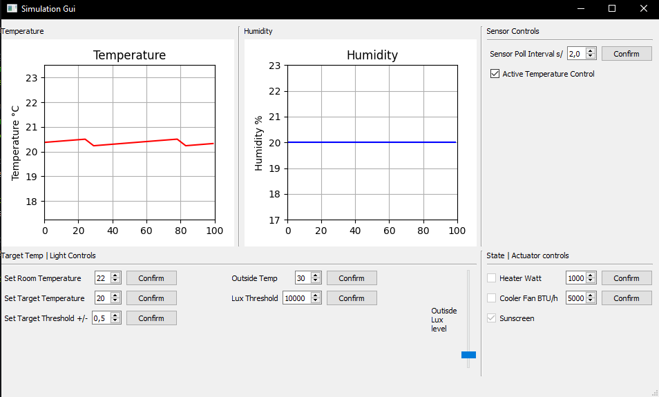

# ATP Room Temperature Control Simulation

This project is a simulation of a room temperature control system. The room is simulated using a C++ Pybind11 module, while the control system is simulated in Python. A PyQt5 GUI is used to display the temperature and actuator information.

## Simulated Sensors and Actuators
- Temperature/Humidity Sensor: DHT22
- Generic Heater and Cooler Actuators
    - The actuators are simulated using a simple on/off switch
    - The actuators can be set to a specific Wattage and BTU

## UI Features
- PyQt5 GUI designed in Qt Designer
- Displays the current temperature and humidity
- Displays the current state of the actuators
- Allows the user to set:
    - Target temperature
    - Target threshold
    - Outside temperature
    - Inside temperature
    - Sensor polling rate

Example of the PyQt5 UI:  


---

## How to Build and Setup

### Pybind11 Module
1. Navigate to the `ATP_Room_Sim` folder.
2. Build the Pybind11 module using the following command:
    ```bash
    pip install .\python_example\
    ```

### Python Code Requirements
Install the required Python packages by running the following command:
```bash
pip install -r requirements.txt
```

---

## How to Run
Use the following command to run the simulation:
```bash
python main.py [--verbose] [--log-output] [--log-time]
```

Optional command line arguments:
- `--verbose`: Prints out all executed functions.
- `--log-output`: Prints the results of all functions with a return value.
- `--log-time`: Prints the execution time of all functions.

---

## How to Test
1. Navigate to the `ATP_Room_Sim/pytest` folder.
2. Run one of the `test_*.py` files.
   The rest will be done automatically.

Total number of tests: 36  
Latest results: `36 passed, 0 skipped, 0 failed in 9.20 seconds`

---

## Note for Alterations
If you make any changes to the Pybind module, ensure the following files also reflect the changes:
- `python_example/setup.py`:
  ```python
  ext_modules = [
      Pybind11Extension("{Module Name}",
      )
  ]
  ...
  
  setup(
      name="{Module Name}"
  )
  ```

- `python_example/src/main.cpp`:
  ```cpp
  PYBIND11_MODULE({Module Name}, m)
  ...
  ```

- Possible files that may require the same name:
  - `docs/conf.py`